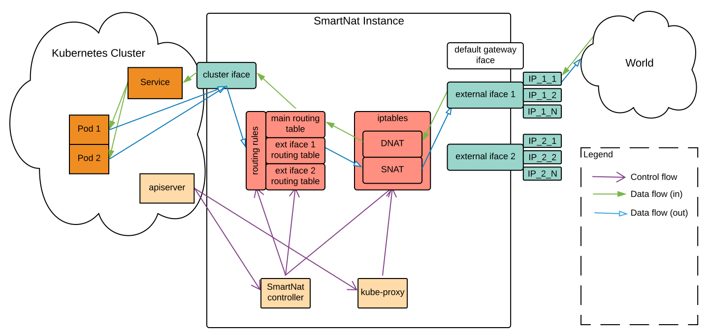

# Intro

SmartNat is a Kubernetes controller which exposes services using IP/TCP/UDP directly. It targets limitations that arise when you’re trying to use NodePort, LoadBalancer or Ingress for non-HTTP services. A single $10 Linux instance can expose hundreds of Services and with two of them you can already be Highly Available.
SmartNat is configured using [CRDs](https://kubernetes.io/docs/concepts/extend-kubernetes/api-extension/custom-resources/) and implemented with [kubebuilder](https://book.kubebuilder.io/). It can run in HA mode and offers features like basic traffic filtering and port translation.
Internally, SmartNat uses a lot of linux networking utilities like `ip route`, `ip addr`, `ip rule`, `iptables` and `ipset`. To easily execute and handle them, it heavily uses our [https://github.com/DevFactory/go-tools](https://github.com/DevFactory/go-tools) library.

# How does it work
SmartNat interconnects two networks: an internal network of a kubernetes cluster and an external network, where it has a set of static IP addresses assigned. Then, it can map any TCP/UDP traffic coming to one of the external IP addresses and ports to a virtual in-cluster IP address associated with one of your [kubernetes services](https://kubernetes.io/docs/concepts/services-networking/service/). That way you can expose multiple kubernetes services for each of the external IPs your node has configured. This is significantly cheaper than creating LoadBalancer for each of your Services and much more scalable than using NodePort.

SmartNat is best run on a dedicated computing instance or cluster node, where it can setup all of its networking aspects. Such computing instance dedicated to running SmartNat controller is called just "SmartNat instance" further on.

Internally, SmartNat works by fetching information about its Mapping objects, Pods and Services from kubernetes API server. Then, this information is used to configure local [NAT](https://en.wikipedia.org/wiki/Network_address_translation) (with `iptables` and `ipset`) and forwarding (with `ip rule` and `ip route`) on the instance.

The traffic and control flow of a cluster using a dedicated instance to run SmartNat controller is depicted below:

# Features
* Low level (L3/4 technology only): you can forward any protocol on top of TCP or UDP, not only HTTP.
* Cheap: costs as much as a single Linux server, no need to create multiple LoadBalancers with your cloud provider.
* High density: supports multiple network interfaces and multiple IP addresses on a single instance. Allows to configure mapping for a single IP:port pair(external endpoint).
* Flexible: allows multiple services to use the same external port number (by using different external IP).
* Easily scalable: if you need more external endpoints, just start more SmartNat instances.
* Highly Available: you can expose the same service using multiple SmartNat instances and external endpoints.
* Easy configuration: Kubernetes native configuration using Custom Resources, which also provide configuration feedback to the user.
* Security: supports basic traffic filtering based on client's source IP address.
* Supports outgoing connections as well: your pods can leave the cluster with different external source IP addresses.

# Use cases
SmartNat is most probably a good choice for you when:
* you have many services to expose from your cluster and using LoadBalancers will be very expensive,
* you need to expose services using a different protocol than HTTP,
* you need to expose multiple services that want to use the same external TCP/UDP port.

# Alternatives
1. [NodePort](https://kubernetes.io/docs/concepts/services-networking/service/#nodeport): it allows you to expose any service on a specific port on each node, but you have to use the pre-configured range of port numbers (default: 30000-32767) and you can't really use different IP addresses for different services. Still, it might be good enough for simpler scenarios.
1. [LoadBalancer](https://kubernetes.io/docs/concepts/services-networking/service/#loadbalancer): it allows you to easily expose your service using your cloud provider's load balancing service (ie. ELB on AWS). If you have a lot of services, this can cost a lot of money. Still, if you want and can accept the cost, this might be the easiest way to go.
1. [Ingress](https://kubernetes.io/docs/concepts/services-networking/ingress/): this is probably the best solution if you have HTTP only services. Some Ingress implementations support TCP and UDP also, but you can't easily use multiple IP addresses with them. As a result, it won't be possible to expose different Services using the same port number.

# Limitations
* Currently, external IPs and port numbers are assigned manually and statically, so you need to allocate them in advance.
* You need to provision a dedicated server or cluster node to run your SmartNat. This instance has to have external network interfaces and IP addresses configured, but at the same time needs a dedicated network interface to connect to your cluster.
* The performance, throughput and the number of services you can expose using a single SmartNat instance depends heavily on the networking and computing power of that instance. The operator of the instance is responsible for monitoring them.

# User's guide
If SmartNat is already deployed in your cluster and you just want to configure it for your service, [read this](doc/user_guide.md).

# Smartnat installation - getting started for administrators
Please [check here](doc/ops_guide.md) for information about how to deploy SmartNat.

# Getting started - developers
If you want to to setup a dev environment and start coding on SmartNat, please [have a look here](doc/dev_guide.md).

# FAQ
Q: Why the lowest version is 2.0.1?  
A: Internally, we already had a previous implementation that was called "v1". To avoid confusion within the company, we had to start numbering this open source release with "v2".

Q: Is IPv6 supported?  
A: No, currently only IPv4 is supported.
