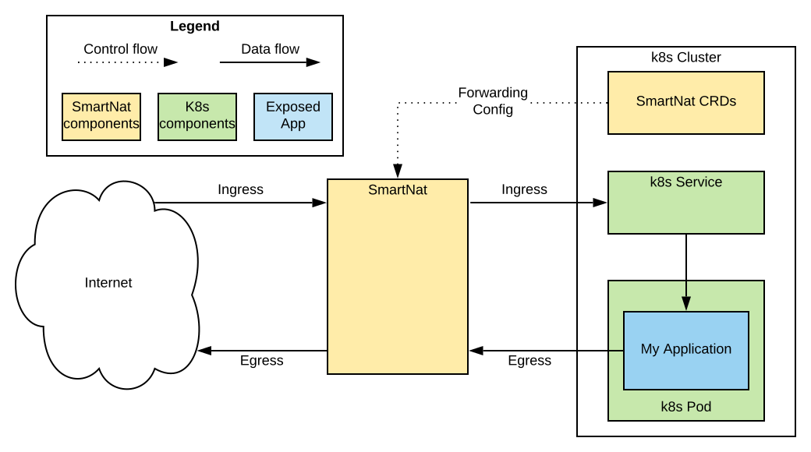
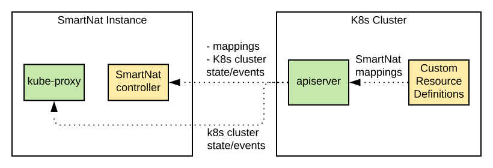
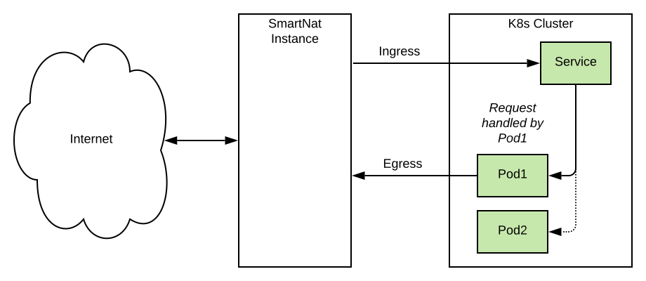

# Background & Scope

## Product/Company Positioning

*What is most important to know about Who, What, How, and Why?*

### CUSTOMER NICHE

*Who is the product for?*

Anyone using cloud-hosted Kubernetes, including the cloud providers themselves

### BUSINESS PROBLEM
*What business problem are they trying to solve?*

Externally exposing multiple ports and protocols from k8s-managed applications; these can be required by any kind of k8s application, but are particularly common during lift-and-shifts of real-world on-prem applications to the cloud + k8s.</td>

### PRODUCT SOLUTION

*What does this product do for them that solves it?*

A cost-effective, scalable Kubernetes-specific router that exposes outside the cluster as many pods/services as needed for any protocol/port combinations.</td>

### <a name="altsol"></a>ALTERNATIVE SOLUTION

*What is an alternative solution to the problem?*

- **[LoadBalancer](https://kubernetes.io/docs/concepts/services-networking/service/#loadbalancer)** 
    - Works with any protocol/port combination;
    - Typically provided by the cloud platform i.e. AWS, GCP, etc.
    - Expensive and Harder to Manage: e.g. AWS requires one LB per exposed service
- **[Ingress](https://kubernetes.io/docs/concepts/services-networking/ingress/)** (including custom controllers, like [gloo](https://gloo.solo.io/)): 
    - Only handles HTTP traffic
- **[NodePort](https://kubernetes.io/docs/concepts/services-networking/service/#nodeport)**
    - Only exposes a single service port
    - Limited to range of ephemeral ports (i.e. 30000–32767, configurable on some providers); can’t expose important low ports like 80, 443, 8080.
    - Hard to Secure, Hard to Manage, and not especially friendly to clients. Meant as building-block for Ingress controllers, et. al.</td>
 
### IMPLEMENTATION APPROACH

*What is the important idea about the implementation approach for this product?*

SmartNat sits outside of a k8s cluster yet has knowledge of what is running in the cluster, and uses NAT to route external traffic to services within the cluster. It interfaces with network stack of the SmartNat host to operate as a Layer 4 router, capable of handling all TCP/UDP based protocols. A single IP address may be mapped to any number of k8s-based apps/services. Additional high-value capabilities, such as Load Balancing, are provided natively by k8s yet compatible with SmartNat.</td>

## Product Summary - SmartNat
###IMPORTANT NAMES

*What brands/names will we come across?*

**SmartNat** - product name.

### DELIVERY MODEL

*What does the product deliver to the customer*

Open source software under Apache License 2.0, same as Kubernetes. Published on GitHub:
### BRIEF HISTORY

*How did the product evolve?*

V1 has been in production (internally) for 1 year. It has limited functionality and will not be released to the public.
V2 is a recent rebuild of V1 and took 2 months to develop. It is currently in testing phase and has been released as open source.</td>

### LIFE CYCLE STAGE

*Where is the product in its life cycle?*

Active development

### KEY FIGURES

*Key stats about the product*

- Approximate lines of code - 3k

## Competitive Comparison
### CHALLENGER

*Who are the competitor(s) that you are most likely to lose to?*

There is not much direct competition known to SmartNat’s authors.
Non-direct challengers include:
- Standard K8s options (LoadBalancer, Ingress, NodePort), elaborated [earlier](#altsol) in this doc.
- [MetalLB](https://metallb.universe.tf/) - K8s load balancer for bare metal clusters, using standard routing protocols. Not a direct competitor due to the differences outlined below (won’t work in a cloud).

## CHALLENGER SIMILARITIES

*In what important ways are you similar?*

Works like Ingress but not for HTTP - similar usage model 
Does load balancing, like ELB, MetalLB or some Ingress Controllers like Gloo</td>
 
## CHALLENGER DIFFERENCES

*In what important ways are you different?*

- Unlike **Ingress**, it can support any L7 protocol - not just HTTP
- Unlike **NodePort**, services can expose multiple ports concurrently.
- Unlike **LoadBalancer**, a single SmartNat instance can expose multiple services/pods.
- Unlike **MetalLB**, SmartNat is cloud/on-prem agnostic. MetalLB uses either Layer 2 ARP  or BGP routing that are disabled in virtualized cloud environments; MetalLB will not work in AWS.
- Unlike **MetalLB**, it can allow finer control by exposing/mapping IP:port rather than whole IPs.
- Unlike **MetalLB**, it creates a clear NAT network boundary, that isolates the internal network from the outside world rather than working within one LAN.


# Solution Analysis

## Product Inputs, Outputs, Controls

### INPUTS

*What are the important inputs to the system?*    

Inbound / Outbound traffic between Kubernetes cluster and the outside world.

### OUTPUTS

*What are the important outputs from the system?*

Routed traffic to/from cluster’s internal pods/services.

### CONTROLS

*What are the important things the user controls to affect how the inputs turn into the outputs?*

Configurations of networking on the controlled instance:
- Kubernetes pods and services
- Endpoints configurations (IP, port, hostnames)
- [CRD](https://kubernetes.io/docs/concepts/extend-kubernetes/api-extension/custom-resources/) mappings: external to internal port/hostname mapping.


## Customer-focused CIV Problems

*A CIV Problem is a real problem a customer faces. It describes a market opportunity, not the product.  These statements describe the problem at hand; the problem that the product solves.  CIV Problems are not marketing fluff or spin -- they are honest and correct problem statements, entirely problem-focused, not solution-focused...*

### CHALLENGING PROBLEMS

*Thinking about the customer, what if anything would they find challenging to build themselves?*

- None.

### IMPORTANT PROBLEMS

*Thinking about the customer, what if anything would they say is really Important for the product to solve. What is going to make them pick one competitor over another?*

- It is important to be able to expose existing services to the outside world that rely not only on HTTP but also other TCP or UDP protocols, especially when lifting-and-shifting existing applications to k8s, as non-native-k8s solutions often use a wide-variety of ports and protocols, or when exposing non-HTTP based services, such as databases.

### VALUABLE PROBLEMS

*Thinking about the customer, how does using this product benefit the customer financially?*

- Cloud providers such as AWS generally require one load balancer per k8s-hosted service, charging for each LB deployed; it is valuable to be able to deploy an alternative solution which only requires a single instance for handling multiple services.

## Product-focused CIV Problems

*Sometimes a product needs to solve CIV problems which come from the goals of the company and not its customers. For example, maybe it is important to a company for their SaaS product to scale to 1000 customers, but each customer is not concerned about that.*

## CHALLENGING PROBLEMS

*Thinking about the company building the product, what if anything was challenging in building it?*

- None.

## IMPORTANT PROBLEMS

*Thinking about the company building the product, what if anything was really Important to solve to meet the company’s goals.*

- None.


## Core Functions

*This is about the solution chosen by this particular product, describing the most important things the product does to turn the inputs into the outputs. It’s not about software components, it’s about the logical steps (with the focus on the non-obvious) to get from inputs to outputs, worded to make sense to a user of the product.*

### Configuration

- How SmartNat is deployed and configured to route traffic from external networks to an exposed service.

### Routing

- How SmartNat routes traffic.

### Load Balancing/High Availability

- How SmartNat load balances traffic to enable highly available services.

## Insights

## P2 Technical Insights  
SmartNat has a strong technical core and is well-suited for continued development. The code is compact (< 3k LoC) and most of the approaches taken are appropriate for a native Kubernetes project. However, one key decision -- to deploy SmartNat outside of the k8s cluster -- is the most controversial. Essentially all other k8s projects take extreme care to run 100% natively in k8s, and SmartNat’s failure to do so may hurt community adoption. The good news is that this issue can be addressed. First and foremost, SmartNat can actually be deployed within a k8s cluster today, with some limitations. This is why the external deployment option is currently recommended. **Addressing the issues prohibiting SmartNat from being effectively used from within a k8s cluster should be the next development priority.**
Another potential blocker to SmartNat’s adoption, especially for production environments, is that it is a single **point-of-failure**. Although there are no reports of stability issues, this will certainly be identified as a valid concern by the community. Likely, **open source projects** such as [keepalived](http://www.keepalived.org/) **can be utilized to easily address this concern**.
  
### P2 Other Feedback
If the goal is to showcase SmartNat as a true open source contribution, it is not enough to simply make the source code available. There is a distinct difference between "source opened" and “open source.” Open source is far more about the community than the source code itself. SmartNat is an impressive piece of technology and solves a real-world problem that has the potential to be of high interest to many. This is both a blessing and a curse -- if DevFactory takes an appropriate approach towards building an open source community around SmartNat, that can have untold positive benefits broadly for all of ESW. On the other hand, a heavy-handed, closed minded approach that does not value community above all else has the potential to not only jeopardize SmartNat’s open source future, it can irrevocably tarnish DevFactory’s perception by the broader open source community.

# Implementation 
*Including Important Technical Decisions - ITDs and Important Functional Decisions - IFDs.*

## Whiteboard Diagram
*If you were going to explain how the product works to someone, what diagram would you draw on the whiteboard that you would then talk through?*



# Implementation Overview
*Explain what the technical solution is in simple terms*
 
- SmartNat is an edge-network instance between k8s cluster and the outside world.
- It maps TCP/UDP traffic coming to one of its external IP addresses and ports to a virtual in-cluster IP address associated with a [k8s Service](https://kubernetes.io/docs/concepts/services-networking/service/).
- The k8s Service, in turn, routes the traffic to an instance of the deployed application.
- SmartNat is deployed on a dedicated host with potentially several network interfaces and IP addresses assigned to those interfaces; a minimum of two interfaces is required -- one for the external traffic and the other for connecting to the cluster.
- It uses [custom resource definitions (CRDs)](https://kubernetes.io/docs/tasks/access-kubernetes-api/extend-api-custom-resource-definitions) in k8s to store mapping configuration that defines how k8s Services are exposed to the outside world ([sample](#apx1)).
- It can be scaled out for HA.


## Core Function: Configuration

**Background**

SmartNat is a software-based router which is deployed external of the Kubernetes cluster, yet the desired routing configuration is defined within the cluster as k8s custom resource definitions (CRD). A Mapping CRD expresses the mapping between external IPs and ports and internal services and ports ([example](#apx1)). An additional SmartNat service ("apiserver") is deployed within the cluster to listen for associated configuration changes and report them to the external SmartNat instance via a locally deployed [kube-proxy](https://kubernetes.io/docs/reference/command-line-tools-reference/kube-proxy/). 



### Important Decisions

#### ITD 1 - Deploy SmartNat outside k8s cluster

**THE PROBLEM**

Deciding whether SmartNat is deployed as a part of k8s environment or not has strong consequences on the ease of development of the appliance. What is the right deployment approach?

**OPTIONS CONSIDERED** (Decision in bold)

1. Deploy SmartNat on dedicated nodes as part of k8s cluster. 
1. **Deploy SmartNat outside K8s cluster, requiring management independent from K8s.**

**REASONING**

Option 1 allows uniform management of the whole ecosystem, but implies creating singular SmartNat nodes in k8s just for SmartNat. Special means would have to be taken to ensure that no workloads are deployed on these nodes.
Option 2 favors implementation simplicity, isolating the appliance from the k8s cluster. Other than a lightweight apiserver and zero-weight CRDs, no additional workloads are placed into the cluster so the current resource utilization remains the same.</td>

**P2 FEEDBACK**

This approach may be perceived by the community as against the "Kubernetes way," inasmuch as the solution is not 100% deployed within k8s itself. The reasoning against option 1 does not necessarily ring true -- it is not absolutely the case that a SmartNat node would need to be dedicated. In fact, option 1 does work today, but due to its limitation of requiring a dedicated node, it’s not recommended by the project leads. This represents an area for improvement.

**REBUILD ASSESSMENT** *(Would you make this decision if you were building the product from scratch now? [Y/N])*

N. Although this was certainly a fast path towards demonstrable success, it is not a pure k8s solution, and, in order to build a community around this project, that is likely to be a major blocker. Resolving the issues mandating a dedicated node deployment for a native k8s solution is the recommended next evolution of the project.


#### ITD 2 - Use custom resource definitions as the source of configuration.
**THE PROBLEM**

Where should SmartNat store its configuration?

**OPTIONS CONSIDERED** (Decision in bold)

1. **Store SmartNat configuration as [custom resource definitions (CRDs)](https://kubernetes.io/docs/tasks/access-kubernetes-api/extend-api-custom-resource-definitions).**
1. Use [labels](https://kubernetes.io/docs/concepts/overview/working-with-objects/labels/) to provide configuration metadata on K8s objects.

**REASONING**

Both approaches centralize access to the configuration in k8s and make it available through [apiserver](https://kubernetes.io/docs/concepts/overview/components/#kube-apiserver). However, labels, used in v1 of the product, proved to be difficult control structures for carry NAT configuration as they are plain text with many restrictions (max length, conforming to DNS syntax, etc.). Using custom resources allows problem-specific data structures and removes the limitations of the former approach.  </td>

**P2 FEEDBACK**

None.

**REBUILD ASSESSMENT** *(Would you make this decision if you were building the product from scratch now? [Y/N])*

Y. The use of CRDs is the recommended approach for defining resources and their respective controllers.

#### ITD 3 - Use Kubebuilder to discover runtime configuration of a K8s cluster.

**THE PROBLEM**

SmartNat must efficiently monitor k8s configuration to be able to correctly configure routing. How can this be done?

**OPTIONS CONSIDERED** (Decision in bold)

1. Implement a control loop to monitor resource changes. 
1. **Use [Kubebuilder](https://github.com/kubernetes-sigs/kubebuilder) API to abstract low-level APIs that monitors K8s resource changes.**

**REASONING**

SmartNat v1 use the imperative approach to monitoring resources, requiring low-level code. Upon the introduction of the open source Kubebuilder project, this was used to create a higher-level replacement. It is a cleaner implementation, as SmartNat only has to subscribe to cluster events and does not have to implement low-level code to sync with k8s.
    
**P2 FEEDBACK**

None.
 
**REBUILD ASSESSMENT** *(Would you make this decision if you were building the product from scratch now? [Y/N])*

Y. This continues to be a valid decision.

## Core Function: Routing

**Background**

Once the desired services and ports to expose are configured, it is necessary for SmartNat to make the necessary networking changes on its host to properly route the traffic. This is done in a manner similar to most Linux-based NAT devices. Deployed with at least one ingress network interface and one cluster-configured interface, SmartNat adjusts the system’s iptables and routing tables to properly route traffic.


### Important Decisions

#### ITD 4 - Enforce NAT and routing by changing host’s IPtables and routing rules

**THE PROBLEM**

How will SmartNat route traffic as defined by the desired configuration?

**OPTIONS CONSIDERED** (Decision in bold)

1. **Enforce NAT and routing between internal and external network interfaces by changing host’s IPtables and routing rules.**
1. No viable alternatives are known.

**REASONING**

SmartNat is the control plane that instruments the network configuration of the underlying host - the data plane - that handles the actual traffic. Such architecture is aligned with best practices of designing network appliances and delegates the actual workload handling to the underlying operating system where it can be done efficiently.

**P2 FEEDBACK**

None.

**REBUILD ASSESSMENT** *(Would you make this decision if you were building the product from scratch now? [Y/N])*

Y. This is a fairly common pattern for designing a NAT device. An alternative approach would be a wholesale replacement of the OS networking stack, perhaps going as far as creating a single-purpose microkernel, but there are no meaningful benefits to that approach. Any potential (and likely very minor) performance gains are not considered valuable, nor is the possibility of routing below Layer 4.

## Core Function: Load Balancing / High-Availability</td>

**Background**

Although simply providing inbound forwarding of TCP and UDP traffic to any exposed port is a great benefit on its own, the most common scenario this addresses is the replacement of several expensive cloud-vendor-provided Load Balancers with a single instance. As such, to be an effective replacement, it would be helpful if SmartNat can handle not only the routing task but also the load balancing task.
SmartNat takes a very simple and effective approach -- it does not offer any load balancing capabilities of its own and instead defers balancing to native Kubernetes Service definitions. This is an elegant solution, permitting users to continue to define service replicas the way they already do, both for load balancing and high-availability of services. Moreover, this approach can automatically leverage any advancements in native k8s service balancing, an area of active development.

Note that if only a single SmartNat instance is deployed, it effectively becomes a single point-of-failure. However, multiple instances may be deployed in front of the same k8s cluster. How traffic is directed to one instance or the other is the responsibility of the user.



### Important Decisions

#### ITD 5 - Use K8s Service for load balancing.

**THE PROBLEM**

It is important that the solution allows efficient load balancing of user traffic. What should be the right implementation approach?

**OPTIONS CONSIDERED** (Decision in bold)

1. Use direct pod forwarding to implement load balancing, requiring imperative implementation in SmartNat.
1. **Rely on k8s [Service](https://kubernetes.io/docs/concepts/services-networking/service/#loadbalancer) implementation to enable load balancing.**

**REASONING**

The solution delegates the responsibility of load balancing to k8s rather than implementing it on its own. It allows leveraging all the existing features enabled by services, e.g. session stickiness. As a consequence, this approach requires deploying [kube-proxy](https://kubernetes.io/docs/concepts/overview/components/#kube-proxy) in SmartNat to discover k8s services.
  
**P2 FEEDBACK**

From the perspective of what can be expected from a load balancer, this is somewhat a simplifying decision. The approach is protocol-agnostic and, as such, cannot automatically respond to application-level failures (e.g. a web server which is still responding, but all the responses are HTTP status code 500). However, when used in conjunction with other native k8s approaches, even these situations can be handled -- one of the key benefits of deferring the task to k8s.

**REBUILD ASSESSMENT** *(Would you make this decision if you were building the product from scratch now? [Y/N])*

Y. This continues to be a valid approach.

#### IFD 6 - High-availability of SmartNat is responsibility of user.

**THE PROBLEM**

SmartNat itself is a potential single point-of-failure. How is this addressed?

**OPTIONS CONSIDERED** (Decision in bold)

1. *High-availability of SmartNat is responsibility of the user*
1. No other options considered

**REASONING**

Multiple instances of SmartNat may be deployed in front of a k8s cluster, and they will operate properly. Using round-robin DNS, load can be balanced across the instances, should load be a concern. If high-availability is required, such that no traffic is directed to a failed SmartNat instance, the user will need to deploy their own solution to this problem.

**P2 FEEDBACK**

None

**REBUILD ASSESSMENT** *(Would you make this decision if you were building the product from scratch now? [Y/N])*

N. Although a completely reasonable decision given the stage of the project, high-availability of SmartNat should be addressed. One approach would be to utilize [Virtual Router Redundancy Protocol - (VRRP)](https://en.wikipedia.org/wiki/Virtual_Router_Redundancy_Protocol) by adding keepalived to the solution, a well-established way to provide similar automatic failover for other networking projects such as HAProxy.

# Additional Analysis

## Simplifying Suggestions

*What are the biggest impact changes we could make to make the product code base simpler to support?*

None. This is not a legacy product. This doc describes its recent release. The solution has a purposeful architecture based on lessons learned from the previous major version (v1). Less than 3k LoC, there is no identified way to simplify it any further.


## Tech Stack Report

*What are the main technologies used in the product?*

### SOFTWARE STACK:

#### Languages 
 
 | Language | Estimated LoC | Where used |
 | -------- | ------------ | ----------- |
 | [Go](https://golang.org/) |2.5k | SmartNat Controller | 
 

#### Important Frameworks and Libraries

| Name | Where Used | Open Source or Commercial |
| -------- | ------------ | ----------- |
| [Kubebuilder](https://github.com/kubernetes-sigs/kubebuilder) | Used by SmartNat Controller to respond to runtime events from the K8s cluster. | Open Source |

#### Important Storage
 
| Type | Where Used |
|------|------------|
| Custom Resource Definitions in K8s | Configuration read by SmartNat Controller |

#### Databases

None.

#### Other

None.

### DEPLOYMENT STACK:

#### OS, Hardware, Hosting

| Parts of system | OS | Hosting | Location | Approx # of hosts | Special Hardware | 
|-----------------|----|---------|----------|---------------|------------------| 
| All | Linux | Dedicated hosts | AWS EC2 | 5 |2 or more network interfaces on a host are required |

## AWS/Central Assessment

*What issues would prevent the product from easily migrating to AWS/Central infrastructure? What recommendations would make that migration simple?*

Not applicable - this software already runs in AWS/Central and solves this infrastructure’s issues.

## AWS/Central Recommendation

*What issues would prevent the product from easily migrating to AWS/Central infrastructure? What recommendations would make that migration simple?*

Not applicable - this software already runs in AWS/Central and solves this infrastructure’s issues.

# Appendices

## <a name="apx1"></a>Appendix 1 - Example SmartNat Custom Resource Definition

```yaml
apiVersion: smartnat.aureacentral.com/v1alpha1 # this is constant
kind: Mapping
metadata:
  name: mapping-sample             # your Mapping name
spec:
  addresses:                       # list; at least 1 address is required
  - "10.237.94.10"
  - "172.17.0.1"
  allowedSources:                  # list; if no CIDR prefixes are given, the default "0.0.0.0/0" is used
  - "10.0.0.0/16"
  - "192.168.1.0/24"
  serviceName: "echo-test-service" # the name of the Service to target; must be in the same namespace
  mode: "service"                  # mandatory; "service" is currently the only supported mode
  ports:                           # list; at least 1 address is required;
  - port: 8080       # maps from external 8080 to 8080 TCP on Service side (same ports and TCP by default)
  - port: 8081                     # maps from external 8080 to 8081 TCP on Service side
    servicePort: 8080
  - port: 8081                     # maps from external UDP port 8081 to 8080 UDP on Service side
    servicePort: 8080
    protocol: "udp"
```

# Follow-up Recommendations

## Follow-up Summary

None.

